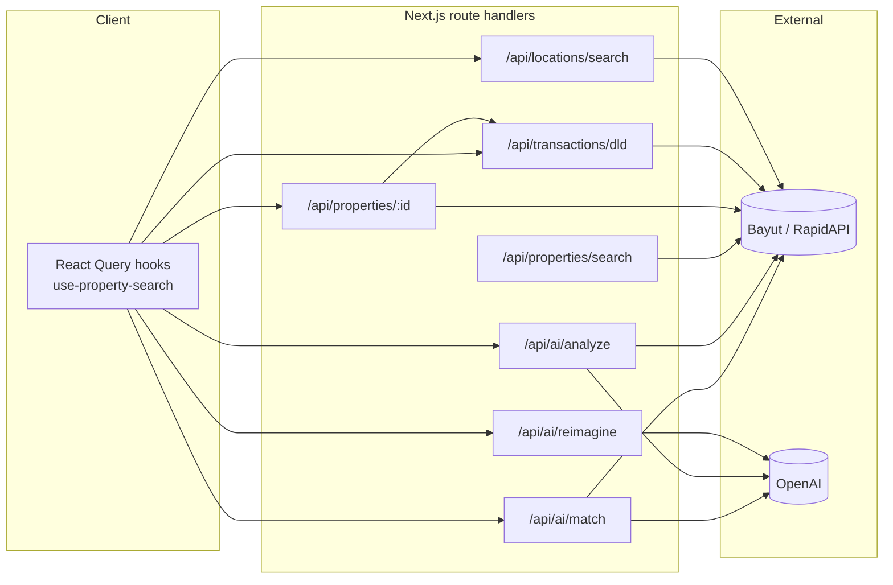
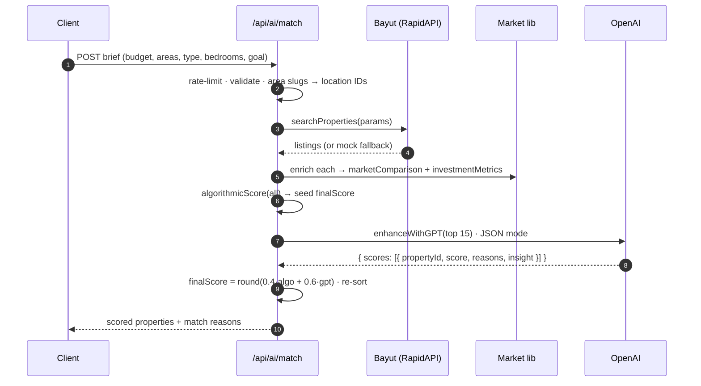
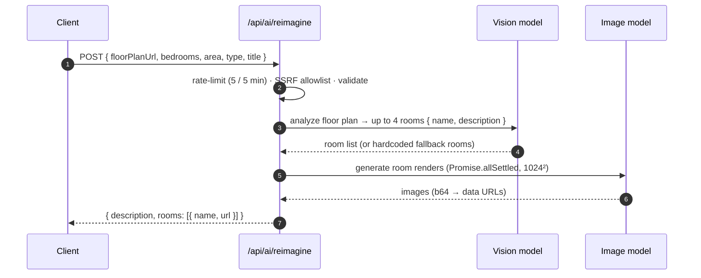
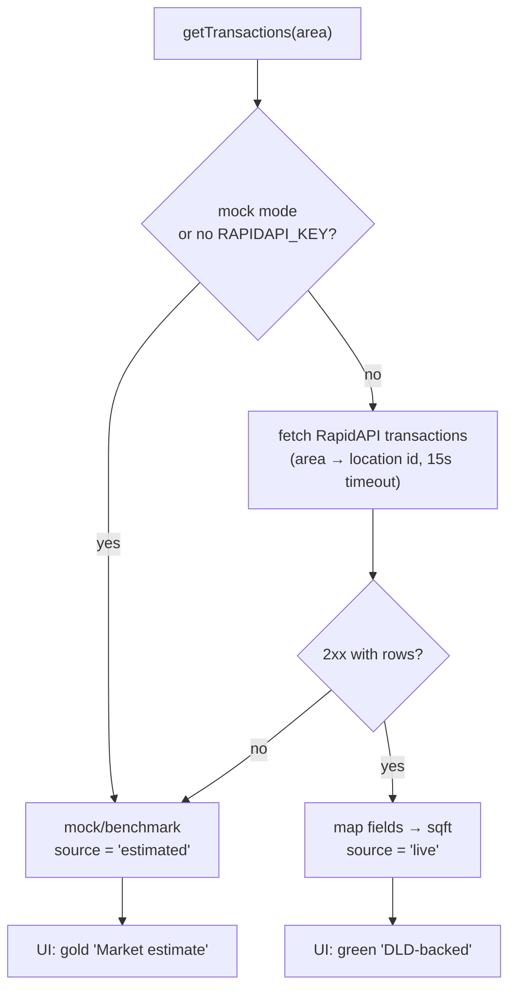

# Architecture

This document explains how the app is put together: the AI pipeline, the data-source
resolution, the market-intelligence math, state management, and the security posture.

- [Request topology](#request-topology)
- [The AI matching pipeline](#the-ai-matching-pipeline)
- [Single-property analysis](#single-property-analysis)
- [Floor-plan reimagine](#floor-plan-reimagine)
- [Data-source resolution & honesty](#data-source-resolution--honesty)
- [Market intelligence math](#market-intelligence-math)
- [State management](#state-management)
- [Security](#security)
- [Module map](#module-map)

---

## Request topology

Every third-party API is proxied through a Next.js **route handler** so credentials stay
server-side and responses can be enriched, validated, and rate-limited before reaching the client.



> In **mock mode** (`NEXT_PUBLIC_USE_MOCK=true`) the client hooks short-circuit to bundled
> mock data and never call the routes — useful for offline development and demos.

---

## The AI matching pipeline

Matching is **two-phase**: a deterministic pre-score runs over *every* listing (cheap, fast,
explainable), then an LLM refines only the strongest candidates (expensive, nuanced). Scores are
blended so the model never fully overrides the transparent baseline.



**Phase 1 — algorithmic score (0–100).** A weighted sum designed to be legible and
tunable without a model call:

| Signal | Weight | Basis |
|---|---:|---|
| Budget fit | 0.30 | distance from mid-budget; harder penalty above max |
| Location | 0.25 | preferred-area match > work/study proximity > baseline |
| Investment | 0.20 | tiered on price-vs-market % |
| Property type | 0.15 | exact/any match |
| Bedrooms | 0.10 | exact / off-by-one / else |

**Phase 2 — GPT enhancement.** The top 15 pre-scored properties are sent to the model with a
compact, one-line-per-listing payload. The model returns a per-property score plus
human-readable reasons and an insight. The final score is
`round(0.4 × algorithmic + 0.6 × gpt)`.

**Graceful degradation.** No `OPENAI_API_KEY`, a model error, or invalid JSON → the pipeline
keeps the algorithmic scores and algorithmically-generated reasons. The product still works, it
just loses the LLM nuance.

---

## Single-property analysis

`/api/ai/analyze` produces the investment write-up on the detail page (summary, strengths,
risks, recommendation, price/rental/outlook). It grounds the prompt in the computed market
comparison and investment metrics, requests JSON, and falls back to a deterministic template
(`generateFallbackAnalysis`) when the model is unavailable.

---

## Floor-plan reimagine



This is the most expensive endpoint (one vision call + up to four image generations per
request), which is why it carries the strictest rate limit and an SSRF allowlist on the URL.

---

## Data-source resolution & honesty

Both the listings client (`bayut.ts`) and the transactions client (`dld.ts`) resolve to
**live data or a labeled fallback** on every call. The transactions response carries a
`metadata.source` flag that drives the UI badge.



The failure path is intentional: a missing subscription, a rate-limit, or a network error never
throws to the user — it degrades to estimates and says so.

---

## Market intelligence math

All three are pure functions over a listing + the 30-area benchmark table.

**Price vs market** (`lib/market/comparison.ts`)
`percentageDiff = (pricePerSqft − median) / median × 100` → badge: *below* market (favourable,
≤ −3%), *neutral*, or *above* market (> +3%).

**Investment metrics** (`lib/market/roi-calculator.ts`)
Net annual rent = gross rent × (1 − 5% vacancy) − service charge − 1% maintenance;
capital appreciation is the benchmark YoY, conservatively halved.

**5-year ROI** — a single `projectRoi(price, netYield, appreciation)` is the source of truth for
**both** the metric card and the chart, so they cannot diverge:

```
totalInvested = price × (1 + 6% buying costs)
for year y in 0..5:
    value      = price × (1 + appreciation)^y      # compounded
    proceeds   = value × (1 − 2% exit costs)
    equity     = proceeds + netAnnualRent × y       # realizable if sold at y
    roi(y)     = (equity − totalInvested) / totalInvested × 100
fiveYearROI = roi(5)
```

---

## State management

| Concern | Mechanism | Notes |
|---|---|---|
| Questionnaire answers | Zustand + `sessionStorage` | serialized to URL params on completion |
| Cross-page results criteria | **URL search params** | results pages are shareable / refresh-safe |
| Compare selection | Zustand + `localStorage` | max 4; survives navigation |
| Server data | TanStack Query | staleTimes: search 5m, detail 10m, transactions 10m, analysis 30m |
| Hydration-safe client flags | `useMounted()` | `useSyncExternalStore`, no setState-in-effect |

---

## Security

| Route | Per-IP limit | Extra controls |
|---|---|---|
| `/api/ai/reimagine` | 5 / 5 min | SSRF allowlist on `floorPlanUrl` (Bayut HTTPS only), body-size guard, clamped numeric inputs |
| `/api/ai/match` | 30 / min | body-size guard, capped `areas` list (algorithmic-DoS) |
| `/api/ai/analyze` | 30 / min | body-size guard, `propertyId` validation |

- Keys are read only in server modules; nothing sensitive is exposed via `NEXT_PUBLIC_`.
- Error responses are generic; upstream provider details are logged server-side only.
- **Known limitation:** the rate limiter is an in-memory, per-process fixed window — effective on
  a single long-running server, best-effort on multi-instance serverless. The production upgrade
  is a shared store (Redis/Upstash); the call sites stay identical, only `hit()` changes.

---

## Module map

| Path | Responsibility |
|---|---|
| `lib/ai/matching.ts` | two-phase scoring, blending, reason generation |
| `lib/ai/analysis.ts` | single-property LLM analysis + deterministic fallback |
| `lib/ai/prompts.ts` | system prompts + prompt builders |
| `lib/api/openai.ts` | OpenAI client: chat, JSON completion, image pipeline |
| `lib/api/bayut.ts` | listings search / detail / locations + mock fallback |
| `lib/api/dld.ts` | transactions + price-history aggregation + `source` flag |
| `lib/api/rate-limit.ts` | per-IP fixed-window limiter + client IP resolution |
| `lib/market/*` | comparison, `projectRoi`, price-index |
| `data/market-benchmarks.ts` | 30-area yield / appreciation / price benchmarks |
| `store/*` | questionnaire + compare Zustand stores |
| `hooks/use-property-search.ts` | all TanStack Query hooks (mock-aware) |
