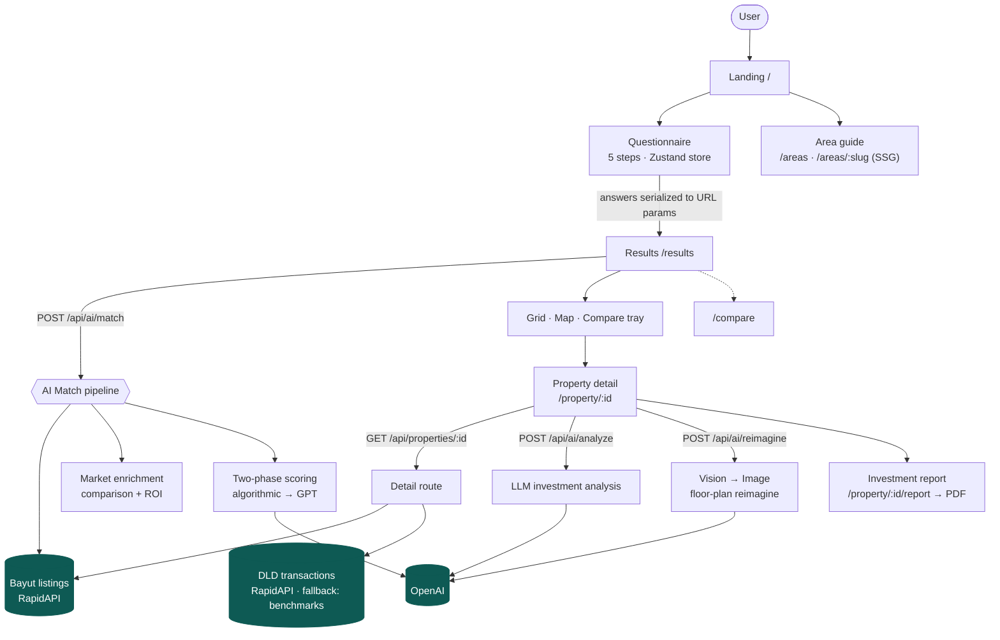

# Dubai Real Estate Intelligence

> **Five questions → an AI-matched shortlist of Dubai properties, with the yield, price-versus-market, and five-year return on every card.**

A discovery product that turns a vague "I want to invest in Dubai" into a defensible shortlist. Instead of thousands of listings and raw filters, you answer five questions and get properties **scored 0–100 against your brief**, each enriched with market intelligence benchmarked to Dubai Land Department (DLD) transaction data.

Built as a demonstration of applied AI engineering: a two-phase matching pipeline, LLM-driven investment analysis, a floor-plan "reimagine" vision→image pipeline, and a defensive, cost-controlled API layer.

---

## Highlights

- 🧠 **Two-phase AI matching** — a fast deterministic pre-score over every listing, then GPT enhancement of the top candidates, blended into a final score.
- 📊 **Market intelligence on every card** — price-vs-median badge, gross/net yield, capital appreciation, and a cost-inclusive 5-year ROI, all from a single shared projection so the number and the chart can never disagree.
- 🖼️ **Floor-plan reimagine** — a vision model reads a 2D floor plan and an image model renders furnished room concepts.
- 🗺️ **Feature-rich UX** — questionnaire → results (grid **or** map) → property detail → side-by-side compare, mortgage/affordability calculator, per-area guides, and a printable investment report (PDF).
- 🛡️ **Defensive API layer** — every external call is server-proxied, rate-limited per IP, input-validated, SSRF-allowlisted, and degrades gracefully to clearly-labeled estimates.
- 🎨 **"Gulf Daylight" design system** — a warm, light, editorial identity (Fraunces serif display + mono figures) driven entirely by CSS tokens.

---

## Platform flow



See **[ARCHITECTURE.md](./ARCHITECTURE.md)** for the AI pipeline sequence, data-source resolution, and module map.

---

## Tech stack

| Layer | Choice |
|---|---|
| Framework | Next.js 16 (App Router) · React 19 · TypeScript |
| Styling | Tailwind CSS v4 · shadcn/ui · CSS design tokens (oklch) |
| Motion / charts / maps | Framer Motion · Recharts · react-leaflet (OpenStreetMap/Carto tiles) |
| State / data | Zustand (persisted) · TanStack Query |
| AI | OpenAI — text + vision (`gpt-4o`, configurable) and image (`gpt-image-1`); Structured Outputs validated with zod |
| Data | Bayut via RapidAPI (listings + DLD transactions) · 30-area static benchmarks |

---

## Getting started

```bash
npm install
cp .env.example .env.local   # fill in keys (see below)
npm run dev                  # http://localhost:3000
```

The app runs fully without any keys — it falls back to bundled mock data and clearly labels figures as **estimates** rather than live/DLD-backed.

### Environment variables

| Variable | Purpose | Required |
|---|---|---|
| `RAPIDAPI_KEY` | Bayut listings **and** DLD transactions (RapidAPI) | For live data |
| `OPENAI_API_KEY` | AI matching, analysis, floor-plan reimagine | For AI features |
| `OPENAI_MODEL` | Text/reasoning model (default `gpt-4o`; set a newer flagship or `gpt-4o-mini` for cost) | Optional |
| `OPENAI_VISION_MODEL` | Floor-plan vision model (default `gpt-4o`) | Optional |
| `OPENAI_IMAGE_MODEL` | Room-render image model (default `gpt-image-1`; needs a verified OpenAI org) | Optional |
| `NEXT_PUBLIC_USE_MOCK` | Force mock data (`true` / `false`) | Optional |

> **Live DLD transactions:** the transactions endpoint is served by a sibling RapidAPI host (`uae-real-estate3`). Subscribe to that API on RapidAPI (free tier) so your existing `RAPIDAPI_KEY` is authorized; otherwise the app falls back to area benchmarks and labels the data **"Market estimate"** instead of **"DLD-backed."**

---

## Scripts

| Command | Description |
|---|---|
| `npm run dev` | Dev server (Turbopack) |
| `npm run build` | Production build |
| `npm run start` | Serve the production build |
| `npm run lint` | ESLint |

---

## Project structure

```
src/
├── app/                      # App Router routes
│   ├── api/                  #   Server proxies: ai/*, properties/*, locations/*, transactions/dld
│   ├── areas/                #   Area guide (index + SSG /areas/[slug])
│   ├── compare/              #   Side-by-side comparison
│   ├── property/[id]/        #   Detail + /report (print-to-PDF)
│   ├── questionnaire/        #   5-step wizard
│   └── results/              #   Grid / map results
├── components/               # UI (landing, questionnaire, results, property, charts, compare, shared, ui)
├── hooks/                    # TanStack Query hooks, useMounted
├── lib/
│   ├── ai/                   # matching, analysis, prompts
│   ├── api/                  # bayut, dld, openai, rate-limit
│   ├── market/               # comparison, roi-calculator (projectRoi), price-index
│   └── constants/            # areas, property types, chart theme, api config
├── data/                     # mock listings, transactions, 30-area benchmarks
└── store/                    # Zustand: questionnaire, compare
```

---

## Data & honesty

Market figures are **area-level benchmarks and estimates**, not a valuation of any specific property. The UI is deliberate about provenance:

- A **"DLD-backed"** badge appears only when a response is sourced from live transactions (`metadata.source === 'live'`); otherwise the UI shows **"Market estimate."**
- The 5-year ROI **includes ~6% buying and ~2% exit costs** and compounds appreciation; assumptions (≈5% vacancy, ≈1% maintenance) are disclosed inline.
- Nothing here is investment advice.

---

## Security posture

All third-party APIs are proxied through server route handlers so keys never reach the client. The AI routes add:

- **Per-IP rate limiting** (strictest on the image-generation route, which fans out to multiple paid calls).
- **Input validation** and body-size guards.
- An **SSRF allowlist** restricting the reimagine `floorPlanUrl` to Bayut hosts over HTTPS.
- **Generic error responses** (no upstream provider internals leaked to clients).

See **[ARCHITECTURE.md](./ARCHITECTURE.md#security)** for details and known limitations (e.g. the in-memory limiter is per-instance; a shared store like Redis/Upstash is the production upgrade).
